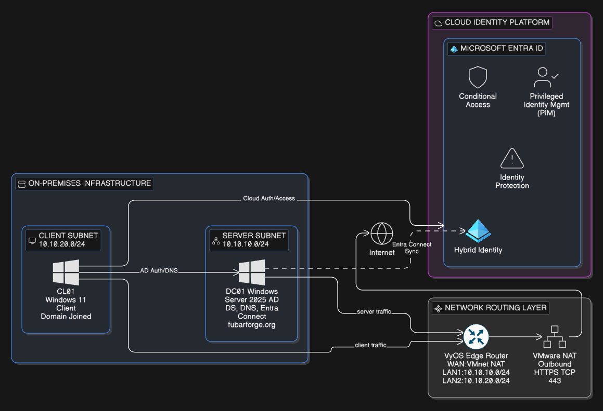

# FubarForge – Identity Management \& Zero Trust

## 

## Project Overview

FubarForge is a hybrid identity lab that demonstrates how modern enterprise identity security can be implemented using Microsoft Entra ID, Conditional Access, Privileged Identity Management, and device compliance controls.

The project integrates an on-premises Active Directory environment with Microsoft Entra ID and applies a Zero Trust security model to authentication and access control.

---

## Architecture Diagram

---

#### \# Core Technologies

The following technologies are used throughout the lab:

\- Windows Server 2025

\- Active Directory Domain Services

\- DNS

\- Microsoft Entra Connect

\- Microsoft Entra ID

\- Conditional Access

\- Privileged Identity Management (PIM)

\- Identity Protection

\- Hybrid Entra ID Join

\- Microsoft Intune

\- VMware Workstation

---

#### \# Lab Goals

The objective of this lab is to simulate a real-world enterprise identity infrastructure and demonstrate modern identity security practices.

Key goals include:

\- Build a structured on-premises Active Directory environment

\- Synchronize selected identities to Microsoft Entra ID

\- Implement Conditional Access policies

\- Enforce Multi-Factor Authentication (MFA)

\- Use Privileged Identity Management for just-in-time privileged access

\- Enforce device compliance using Microsoft Intune

\- Monitor authentication activity through Entra sign-in logs

\- Validate security controls through simulated attack scenarios

---

#### \# Architecture

The environment combines on-premises identity infrastructure with Microsoft cloud identity services.

Main components include:

\- Active Directory Domain Controller

\- Microsoft Entra Connect synchronization

\- Microsoft Entra ID cloud identity platform

\- Conditional Access policy enforcement

\- Microsoft Intune device compliance

\- Privileged Identity Management

Architecture diagrams can be found in the \*\*01-Architecture\*\* folder.

---

#### \# Repository Structure

01-Architecture Identity architecture and authentication flow diagrams

02-Network Network configuration and routing

03-ActiveDirectory Domain structure, users and groups

04-Hybrid-Identity Entra Connect synchronization

05-Conditional-Access Conditional Access security policies

06-PIM Privileged Identity Management configuration

07-Identity-Protection Identity security settings

08-Devices Hybrid join and Intune device compliance

09-Audit-Logs Authentication and security monitoring

10-Security-Testing Simulated attack scenarios and validation

---

#### \# Security Model

The lab implements a \*\*Zero Trust access model\*\* based on three principles:

\- Identity verification

\- Device compliance validation

\- Conditional Access enforcement

Access to cloud resources requires:

\- Multi-Factor Authentication (MFA)

\- A compliant device managed by Microsoft Intune

\- A trusted identity

Authentication attempts from unmanaged systems are blocked.

---

#### \# Security Testing

Security controls are validated using simulated attack scenarios performed from a Kali Linux system.

Examples include:

\- Authentication attempts from unmanaged devices

\- Failed login attempts

\- Conditional Access policy enforcement

\- Intune device compliance validation

These tests demonstrate how Microsoft Entra security controls prevent unauthorized access.

---

#### \# Environment Details

Project name: \*\*FubarForge\*\*  

Domain: \*\*fubarforge.org\*\*  

Cloud tenant: \*\*fubarforge.onmicrosoft.com\*\*

---

##### \# Author

Jonathan De Bundel

## 

